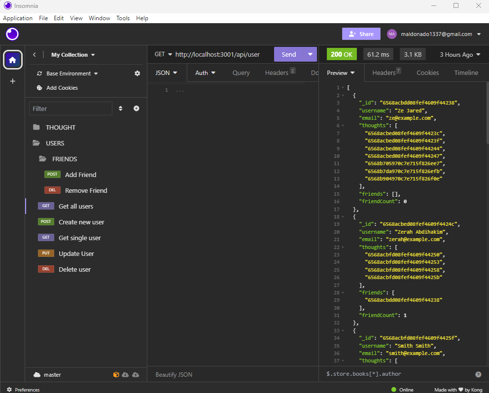
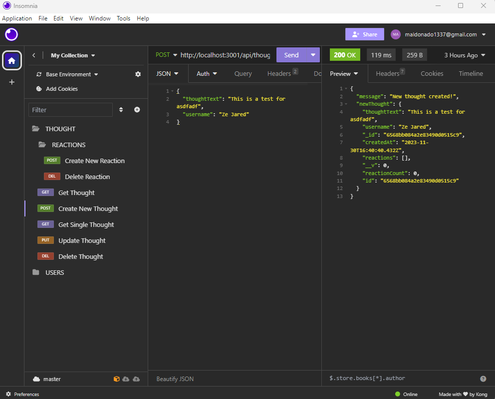

# A Social Network API
<!-- Title  -->

<!-- Title  -->

## Description
This is a API for a social network that will allow you to post, react to friends post and create a friend list. 

---

## Table of Contents

<!-- Table of Contents -->

- [Installation](#installation)
- [About The Project](#about_project)
- [Built With](#built_with)
- [Features](#features)
- [Deployment Location](#deployment_location)
- [License](#license)
- [Final Note](#final_note)

---

## Instalation Instructions 
Need to instal the needed dependencies.

---

## About The Project 
<!-- About the Project -->
This I a project to show the use of MongoDB and Mongoose to make a database for a social network. 

---

### Built With 
<!-- Built With -->
Node, JavaScript, Express, MongoDB, Mongoose, Luxon, Nodemon, MongoDB Compass, Insomnia

---

### Features 
<!-- Features -->

* Users can create posts that are called 'Thoughts'
* Users can react to people's 'Thoughts' with a comment called 'Reactions'
* Users can also create a friend list

---

## Deployment Location 

<!-- Deployment Location -->
Recording: https://drive.google.com/file/d/1vQzQEmDhfL17snKGMtmE42JQtDs9ncrP/view

Github: https://github.com/TrueMiguel/18-A-Social-Network-API

<!-- screen shot example of project -->

---

## License 
MIT License

    Copyright (c) 2023 Miguel Maldonado
    
    Permission is hereby granted, free of charge, to any person obtaining a copy
    of this software and associated documentation files (the "Software"), to deal
    in the Software without restriction, including without limitation the rights
    to use, copy, modify, merge, publish, distribute, sublicense, and/or sell
    copies of the Software, and to permit persons to whom the Software is
    furnished to do so, subject to the following conditions:
    
    The above copyright notice and this permission notice shall be included in all
    copies or substantial portions of the Software.
    
    THE SOFTWARE IS PROVIDED "AS IS", WITHOUT WARRANTY OF ANY KIND, EXPRESS OR
    IMPLIED, INCLUDING BUT NOT LIMITED TO THE WARRANTIES OF MERCHANTABILITY,
    FITNESS FOR A PARTICULAR PURPOSE AND NONINFRINGEMENT. IN NO EVENT SHALL THE
    AUTHORS OR COPYRIGHT HOLDERS BE LIABLE FOR ANY CLAIM, DAMAGES OR OTHER
    LIABILITY, WHETHER IN AN ACTION OF CONTRACT, TORT OR OTHERWISE, ARISING FROM,
    OUT OF OR IN CONNECTION WITH THE SOFTWARE OR THE USE OR OTHER DEALINGS IN THE
    SOFTWARE.

---

## Final Note 
<!-- Final Note -->
This is a demonstration of using MongoDB as a database and creating a social network API. 

---
    